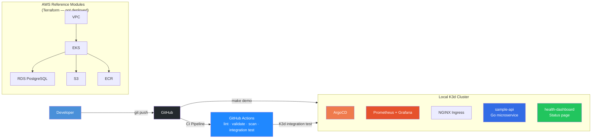

# kubestack-ref

[](https://github.com/vishwassharma98499/kubestack-ref/actions/workflows/ci.yml)
[](https://www.terraform.io/)
[](https://kubernetes.io/)
[](https://argoproj.github.io/cd/)
[](LICENSE)
[](https://codespaces.new/vishwassharma98499/kubestack-ref)
[](https://vishwassharma98499.github.io/kubestack-ref)

> **First-time setup:** Replace all `vishwassharma98499` placeholders with your GitHub username:
> ```bash
> sed -i 's/vishwassharma98499/your-github-username/g' $(grep -rl vishwassharma98499 .)
> ```

**Production-grade Kubernetes + Terraform GitOps reference architecture. Runs locally with one command. No cloud account needed.**

---

## Demo

<!-- 
  ┌──────────────────────────────────────────────────────────┐
  │  DEMO GIF PLACEHOLDER                                    │
  │                                                          │
  │  Record a terminal demo with one of these tools:         │
  │                                                          │
  │  Option 1: asciinema (terminal recording)                │
  │    brew install asciinema                                │
  │    asciinema rec demo.cast                               │
  │    # run: make demo && make demo-test && make demo-down  │
  │    # Ctrl+D to stop                                      │
  │    asciinema upload demo.cast                             │
  │    # Embed: use the SVG link from asciinema.org          │
  │                                                          │
  │  Option 2: VHS by Charmbracelet (GIF output)             │
  │    brew install charmbracelet/tap/vhs                     │
  │    vhs scripts/demo.tape                                 │
  │    # outputs demo.gif — add it below                     │
  │                                                          │
  │  Option 3: ttyrec + ttygif                               │
  │    ttyrec demo.rec                                       │
  │    ttygif demo.rec                                       │
  │                                                          │
  │  Then replace this block with:                           │
  │                            │
  └──────────────────────────────────────────────────────────┘
-->

_Add a demo GIF here — see the instructions above or run `./scripts/take-screenshots.sh` for screenshots._

---

## See It Running in 2 Minutes

```bash
git clone https://github.com/vishwassharma98499/kubestack-ref.git
cd kubestack-ref
make demo
```

That's it. This spins up a real Kubernetes cluster on your machine with:

| Component | What You Get | Local URL |
|-----------|-------------|-----------|
| **Sample API** | Go microservice with health probes, Prometheus metrics, graceful shutdown | `make port-forward-api` → http://localhost:8080 |
| **Health Dashboard** | Live web UI showing API health, latency, and app info | `make port-forward-dashboard` → http://localhost:8081 |
| **ArgoCD** | GitOps dashboard showing sync status of all components | `make port-forward-argocd` → https://localhost:9080 |
| **Grafana** | Pre-loaded dashboards: cluster overview + application metrics | `make port-forward-grafana` → http://localhost:3000 |
| **Prometheus** | Full metrics pipeline scraping all workloads | `make port-forward-prometheus` → http://localhost:9090 |

**Requirements:** Docker (4GB+ RAM free). Everything else is installed automatically.

**Tear down:** `make demo-down` — removes everything cleanly.

---

## Skills Demonstrated

This project maps directly to the skills evaluated in platform engineering, DevOps, and SRE interviews:

| Domain | Skills | Evidence in This Repo |
|--------|--------|-----------------------|
| **Kubernetes** (CKAD-level) | Deployments, HPA, PDB, network policies, security contexts, probes, service accounts, ingress | `kubernetes/apps/`, `kubernetes/base/`, Kustomize overlays for dev/prod |
| **Terraform** | Modular IaC, variable validation, state management, multi-environment design | 7 AWS modules in `terraform/modules/` — VPC, EKS, RDS, S3, ECR, IAM, Security |
| **GitOps** | ArgoCD app-of-apps, declarative infrastructure, automated sync + self-heal | `kubernetes/platform/argocd/` — Application CRs, AppProjects, app-of-apps pattern |
| **Observability** | Prometheus, Grafana, alerting rules, structured logging, custom dashboards | `kubernetes/platform/monitoring/` — 2 dashboards, 10+ alert rules, JSON logging in Go |
| **Security** | OPA Gatekeeper, IRSA, network policies, container hardening, CI scanning | 4 OPA constraints, default-deny netpol, non-root + read-only rootfs, tfsec + trivy in CI |
| **CI/CD** | GitHub Actions, multi-stage pipelines, integration testing, security scanning | `.github/workflows/ci.yml` — 5 jobs including full K3d integration test |
| **Go** | HTTP servers, health probes, Prometheus client, graceful shutdown, structured logging | `app/main.go` — production-grade API with instrumentation |
| **Docker** | Multi-stage builds, distroless images, non-root containers, health checks | `app/Dockerfile`, `kubernetes/apps/health-dashboard/Dockerfile` |
| **Documentation** | Architecture diagrams, runbooks, ADRs, security models, cost analysis | `docs/` — 5 documents + 3 ADRs with Mermaid diagrams |

---

## Architecture



**Two layers of proof:**
1. **Runs live locally** — real K8s cluster with ArgoCD, Prometheus, Grafana, and a production-grade Go API
2. **Production AWS modules** — validated Terraform for VPC, EKS, RDS, S3, ECR, IAM (IRSA), security groups

---

## What's Included

### Live Local Stack (K3d)

- **Go microservice** with health probes, Prometheus metrics, structured JSON logging, graceful shutdown, multi-stage Docker build (distroless runtime)
- **Health dashboard** — real-time web UI showing API health, latency, and build info
- **ArgoCD** — GitOps operator with app-of-apps pattern
- **Prometheus + Grafana** — monitoring with 2 custom dashboards and alerting rules
- **NGINX Ingress Controller** — local ingress routing
- **Kubernetes best practices:** pod anti-affinity, HPA, PDB, resource limits, read-only rootfs, non-root containers, security contexts, network policies
- **Kustomize overlays** for dev (1 replica, debug logging) and prod (3 replicas, warn logging, strict PDB)

### AWS Terraform Modules (Reference, Validated, Not Deployed)

| Module | Resources |
|--------|-----------|
| `vpc` | VPC, 3 public + 3 private subnets, NAT Gateway, flow logs |
| `eks` | EKS cluster, managed node groups, OIDC provider, KMS encryption |
| `rds` | PostgreSQL with encryption, Multi-AZ, automated backups |
| `s3` | Versioned + encrypted buckets with lifecycle policies |
| `ecr` | Container registry with image scanning and lifecycle rules |
| `iam` | IRSA roles for app pods, ALB controller, ExternalDNS, cert-manager |
| `security` | Security groups for EKS, RDS, ALB with least-privilege rules |

All modules have proper variable validation, are `terraform fmt` compliant, and pass `tfsec` + `trivy` scans.

### CI/CD Pipeline (GitHub Actions — Live, Visible)

| Job | What It Does |
|-----|-------------|
| `terraform` | Format check + validate all modules |
| `kubernetes` | kubeconform validation of all YAML |
| `security` | tfsec + trivy scanning on Terraform and K8s manifests |
| `docker` | Build image + smoke test `/healthz` and `/info` |
| `integration` | Full K3d cluster → deploy → verify → teardown |

### Documentation

| Document | Content |
|----------|---------|
| [ARCHITECTURE.md](docs/ARCHITECTURE.md) | Mermaid diagrams: network topology, GitOps flow, request path |
| [RUNBOOK.md](docs/RUNBOOK.md) | Scaling, debugging, rollback, secret rotation procedures |
| [SECURITY.md](docs/SECURITY.md) | IAM/IRSA, network policies, OPA Gatekeeper, encryption |
| [COST_OPTIMIZATION.md](docs/COST_OPTIMIZATION.md) | Spot instances, right-sizing, Kubecost strategies |
| [ADRs](docs/ADR/) | Architecture Decision Records: EKS vs self-managed, ArgoCD vs Flux, Sealed Secrets |

---

## Try It — Three Ways

### 1. GitHub Codespaces (zero install)

Click the button at the top of this README → wait for the container to build → run `make demo` in the terminal. Everything works inside Codespaces, including port forwarding.

### 2. Local Machine

```bash
git clone https://github.com/vishwassharma98499/kubestack-ref.git
cd kubestack-ref
make demo          # Start everything
make demo-test     # Run smoke tests
make load-test     # Generate traffic for Grafana dashboards
make demo-down     # Clean up
```

### 3. Just Read the Code

Every file is production-grade and interviewer-ready. The Terraform modules, Kubernetes manifests, Grafana dashboards, alerting rules, and CI pipeline are all real — no stubs or TODOs.

---

## API Endpoints

Once running (`make port-forward-api`):

```bash
# Health check (used by K8s probes)
curl http://localhost:8080/healthz
# → {"status":"healthy"}

# App info
curl http://localhost:8080/info
# → {"version":"0.1.0","environment":"dev","go_version":"go1.22",...}

# Root
curl http://localhost:8080/
# → {"service":"kubestack-ref-api","status":"operational",...}

# Prometheus metrics (port 9090 inside the cluster)
kubectl exec -n app deploy/sample-api -- wget -qO- http://localhost:9090/metrics
```

---

## Grafana Dashboards

Two custom dashboards are pre-loaded:

**Cluster Overview** — CPU/memory by namespace, pod count, node utilization, pod restarts, disk usage

**Application Metrics** — Request rate, latency percentiles (p50/p95/p99), error rate, per-pod CPU/memory, network I/O

Access: `make port-forward-grafana` → http://localhost:3000 (admin / kubestack-ref)

Generate traffic for visible metrics: `make load-test`

---

## Security Model

- **Container hardening:** non-root (UID 1000), read-only rootfs, all capabilities dropped, seccomp RuntimeDefault
- **Network policies:** default deny-all with explicit allow rules per namespace
- **OPA Gatekeeper constraints:** require labels, deny privileged, require resource limits, allowed registries
- **CI scanning:** tfsec + trivy on every PR
- **IRSA design:** Terraform modules create pod-level IAM roles (no static credentials)

See [SECURITY.md](docs/SECURITY.md) for the full model.

---

## Monitoring & Alerting

Prometheus scrapes all workloads. Alert rules fire on:

- Pod crash looping (>3 restarts in 15 min)
- CPU/memory usage >90% of limits
- 5xx error rate >5%
- p95 latency >2 seconds
- TLS certificate expiring within 30/7 days
- PVC >85% full

See [kubernetes/platform/monitoring/alerting-rules.yaml](kubernetes/platform/monitoring/alerting-rules.yaml)

---

## Project Structure

```
kubestack-ref/
├── app/                              # Go microservice (source + Dockerfile)
│   ├── main.go                       # API server with health, metrics, graceful shutdown
│   ├── Dockerfile                    # Multi-stage: golang builder → distroless runtime
│   ├── go.mod
│   └── go.sum
│
├── terraform/modules/                # Production AWS reference (validated, not deployed)
│   ├── vpc/                          # VPC, subnets, NAT, flow logs
│   ├── eks/                          # EKS cluster, node groups, OIDC
│   ├── rds/                          # PostgreSQL, encryption, backups
│   ├── s3/                           # Buckets, versioning, lifecycle
│   ├── ecr/                          # Registry, scanning, lifecycle
│   ├── iam/                          # IRSA roles
│   └── security/                     # Security groups
│
├── kubernetes/
│   ├── base/                         # Namespaces, quotas, limits, network policies
│   ├── apps/
│   │   ├── sample-api/               # Deployment, service, HPA, PDB, ingress
│   │   └── health-dashboard/         # Live status page (nginx + HTML/JS)
│   ├── overlays/
│   │   ├── dev/                      # 1 replica, debug logging, small limits
│   │   └── prod/                     # 3 replicas, warn logging, strict PDB
│   └── platform/
│       ├── argocd/                   # App-of-apps, AppProjects, Application CRs
│       ├── monitoring/               # Alerting rules + Grafana dashboards (JSON)
│       └── security/opa-gatekeeper/  # Constraint templates + constraints
│
├── scripts/
│   ├── demo-up.sh                    # One-command full stack setup
│   ├── demo-down.sh                  # Teardown
│   ├── demo-test.sh                  # Smoke tests
│   ├── load-test.sh                  # Traffic generation for Grafana
│   ├── take-screenshots.sh           # Port-forward all services for screenshots
│   ├── fix-go-sum.sh                 # Regenerate go.sum via Docker
│   └── split-commits.sh             # Create realistic git history
│
├── .github/
│   └── workflows/ci.yml             # Full CI: lint, validate, scan, build, integration test
│
├── .devcontainer/                    # GitHub Codespaces config
├── docs/                             # Architecture, runbook, security, cost, ADRs
├── Makefile                          # All commands: demo, port-forward, lint, scan
└── README.md
```

---

## Commands

```bash
make help                 # Show all commands
make demo                 # 🚀 Start everything
make demo-test            # ✅ Smoke test the stack
make demo-down            # 💥 Tear down
make port-forward-api     # Forward API → localhost:8080
make port-forward-dashboard # Forward health dashboard → localhost:8081
make port-forward-argocd  # Forward ArgoCD → localhost:9080
make port-forward-grafana # Forward Grafana → localhost:3000
make load-test            # 📈 Generate traffic for Grafana dashboards
make screenshots          # 📸 Port-forward everything for screenshots
make fix-go-sum           # 🔧 Regenerate go.sum with real hashes
make split-commits        # 🔀 Create realistic git history
make build                # Build Docker image only
make run-local            # Run container standalone
make lint                 # Lint Terraform + K8s manifests
make scan                 # Security scan (tfsec + trivy)
make fmt                  # Format Terraform
```

---

## Getting Started After Clone

```bash
# 1. Replace vishwassharma98499 with your GitHub username
sed -i 's/vishwassharma98499/your-github-username/g' $(grep -rl vishwassharma98499 .)

# 2. Fix go.sum hashes (requires Docker)
make fix-go-sum

# 3. (Optional) Create realistic git history
git init && git add -A && git commit -m "initial"
make split-commits

# 4. Push to GitHub
git remote add origin git@github.com:your-github-username/kubestack-ref.git
git push -u origin main

# 5. Run the demo
make demo
```

---

## Contributing

1. Fork → feature branch → `make lint` → PR
2. CI runs automatically (Terraform validate, K8s lint, security scan, Docker build, integration test)
3. Conventional commits: `feat:`, `fix:`, `docs:`, `chore:`

---

## License

MIT — see [LICENSE](LICENSE)
