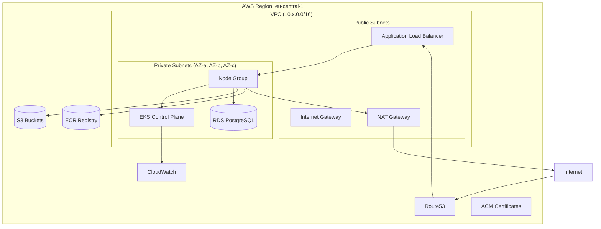
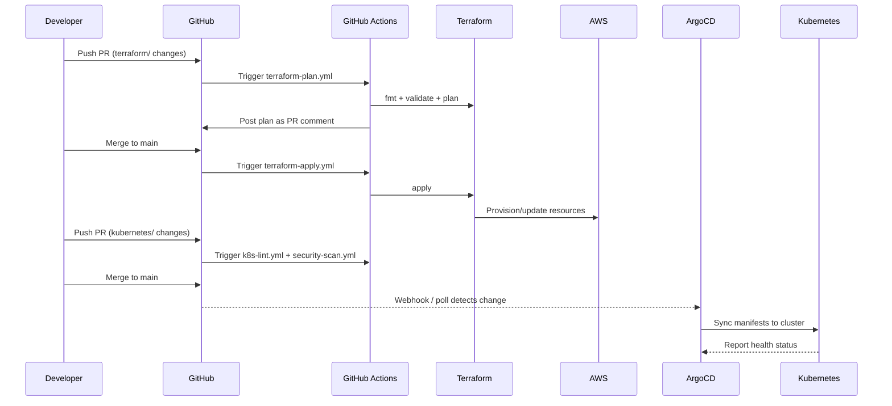
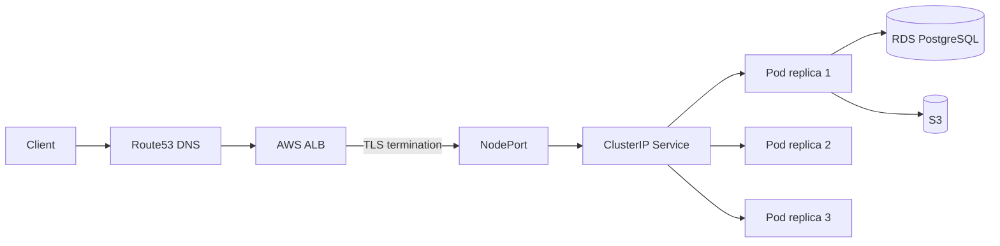

# Architecture

## Overview

kubestack-ref provisions a complete AWS infrastructure stack using Terraform and manages Kubernetes workloads through a GitOps pipeline powered by ArgoCD. All changes flow through Git — infrastructure changes via Terraform PRs, application changes via Kubernetes manifest PRs.

## Network Topology

## GitOps Flow

## Request Path

## Component Interactions

| Component | Role | Managed By |
|-----------|------|-----------|
| VPC, Subnets, NAT | Network isolation | Terraform |
| EKS | Kubernetes control plane | Terraform |
| RDS PostgreSQL | Application database | Terraform |
| S3 | Asset storage + TF state | Terraform |
| ECR | Container image registry | Terraform |
| IAM / IRSA | Pod-level AWS permissions | Terraform |
| ArgoCD | GitOps continuous delivery | Helm (self-managed) |
| Prometheus + Grafana | Monitoring and dashboards | ArgoCD (Helm) |
| Fluent Bit | Log aggregation to CloudWatch | ArgoCD (Helm) |
| AWS LB Controller | Ingress ALB provisioning | ArgoCD (Helm) |
| ExternalDNS | DNS record management | ArgoCD (Helm) |
| cert-manager | TLS certificate automation | ArgoCD (Helm) |
| Sealed Secrets | Git-safe secret encryption | ArgoCD (Helm) |
| OPA Gatekeeper | Policy enforcement | ArgoCD (Helm) |
| Kubecost | Cost visibility | ArgoCD (Helm) |

## Environment Strategy

Three isolated environments share the same Terraform modules and Kubernetes base manifests, with per-environment overrides:

| Aspect | Dev | Staging | Prod |
|--------|-----|---------|------|
| VPC CIDR | 10.0.0.0/16 | 10.1.0.0/16 | 10.2.0.0/16 |
| Node type | t3.medium (SPOT) | t3.large (ON_DEMAND) | m5.large (ON_DEMAND) |
| Node count | 1–4 | 2–6 | 3–10 |
| RDS Multi-AZ | No | Yes | Yes |
| RDS class | db.t3.micro | db.t3.medium | db.r6g.large |
| VPC Flow Logs | Disabled | Enabled | Enabled |
| EKS API | Public | Public | Private |
| App replicas | 1 | 2 | 3 |
| Log level | debug | info | warn |
